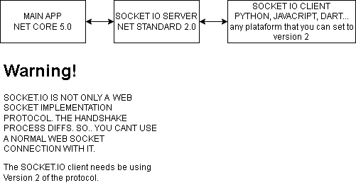

#### This project its just a demonstration and still in development.
#### Este projeto é apenas uma demonstração e ainda está em desenvolvimento.

## [ENGLISH]

This project has  a pourpose to demonstrate a win form application a capacity of extensible by plugins.
The idea its dont import who framework you are using to extended. The only requeriment its a socket.io client with version 2 in its primary form.
The main Socket.IO server implementation of this project its developed by uhm0311 [Click here to view original repo](https://github.com/uhm0311/SocketIOSharp)

This project contains a EXAMPLE(MUCH, MUCH, MUCH.. PRIMARY FORM) TO DO THIS.
This is will be principle of this project:

## [PORTUGUÊS]

Esse projeto tem o propósito de demonstrar a extensibilidade de um aplicativo WinForm por plugins.
A ideia é não importar qual framework você está usando para o desenvolvimento do plugin. O único requisito é um cliente socket.io com a versão 2 em sua forma primária.
A implementação do servidor Socket.IO  deste projeto foi desenvolvida por uhm0311 [Clique aqui para ver o repositório original](https://github.com/uhm0311/SocketIOSharp)

Este projeto contém um EXEMPLO(Muito, Muito primário...) PARA FAZER ISSO.
Este será o princípio deste projeto:

## [Diagram]

